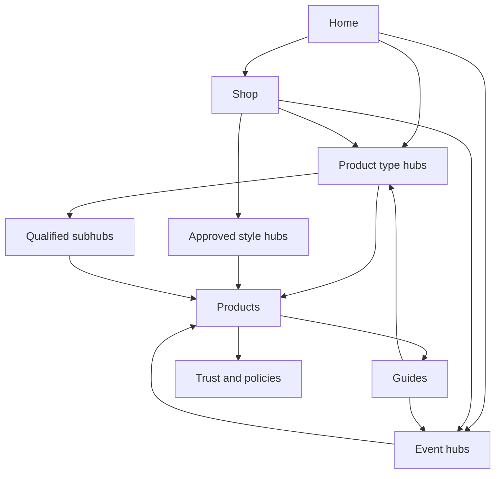

# FEYA Search Architecture v1

Актуальное продолжение 24 September: [Google_Ads_Atomic_Adapter_20260924.md](Google_Ads_Atomic_Adapter_20260924.md) — существующий atomic RPC расширен Google API evidence contract, явный targeting/period/selection, immutable first-capture receipt и атомарные fetch statuses. Migration8 unapplied; exact-head proof фиксируется в PR. Live Google и production activation отдельно; следующий этап — inventory/page pilot.

Дата среза: 23 сентября 2026. Статус: спецификация для реализации и проверки; не разрешение на индексацию. Язык публичного контента — английский; язык управления — русский. Базовый исследовательский контекст — US / en, поскольку он уже используется в портфеле и metric snapshots; это не новое решение ограничить продажи США.

## Решение и границы

FEYA получает один Search & Ecommerce слой поверх существующих Product OS и Growth OS. Существующие UUID товаров, `seo_page_id`, ключи keyword bank, утверждённые Product Truth, черновики и подтверждения сохраняются. Новая семантика не переписывает цены, состав комплекта, визуальную структуру или права агентов.

Индексируемая страница — управляемый актив с собственным намерением пользователя, ассортиментом или иной самостоятельной полезностью, владельцем запросов, версией содержимого и подтверждённым техническим состоянием. Значение Product DNA само по себе не создаёт страницу. До прохождения launch gate глобальная индексация остаётся закрытой.

Документ описывает целевую архитектуру, а не уже работающие возможности. После аудита начат изолированный implementation branch на базе `owner-ui-v1`; точная граница реализации и проверки — в `First_Implementation_Sprint.md`. Production-миграции, запуск платных запросов метрик и включение индексации не выполнялись.

## Как читать доказательства

| Метка | Что означает | Чего не доказывает |
|---|---|---|
| **B — Business truth** | Подтверждения владельца и действующий FEYA canon, включая Product Truth конкретного товара | Популярность запросов или поведение Google |
| **M — Measured FEYA state** | Прочитанные на дату среза строки БД, ограничения, исходный код и metadata deployment | Успешность реальной покупки, индексирование или поведение браузера, если они отдельно не проверены |
| **G — Google / platform confirmed** | Проверенная официальная документация; ссылки G1–G12 в конце | Гарантию индексации, позиций или продаж |
| **O — Observation** | Наблюдение из предоставленных исследований конкурентов | Причину их трафика или конверсии; это не независимо повторённый аудит конкурента |
| **H — FEYA hypothesis / policy** | Наш проектный выбор или проверяемая гипотеза | Требование Google или измеренный результат |
| **U — Unknown** | Данных нет, они не проверены либо расходятся | Нулевой спрос, отсутствие проблемы или разрешение публиковать |

Приоритет источников: актуальное подтверждение владельца по конкретному товару → действующий канон и более позднее предметное уточнение → исполняемый контракт и фактическое состояние → исследования. При конфликте не затирать старую запись: создать decision/change event с причинами и точной областью действия. Исследования могут обнаружить техническую ошибку в каноне, но не менять бизнес-факт без владельца.

## A. CURRENT STATE AUDIT

### A1. Что уже есть

| Слой | Подтверждённое состояние | Архитектурное следствие |
|---|---|---|
| Витрина, **B/M** | Зафиксирован `VISUAL_LOCK_PHASE_C_V1`: тёмная редакционная стилистика, согласованные шрифты/цвета, меню, фильтры, сетка, карточки, PDP и корзина. Скриншоты владельца подтверждают ожидаемую структуру | SEO встраивается в существующие компоненты; новый дизайн не входит в задачу |
| Owner UI, **B/M** | Контракт `OWNER_COMPANY_VISUAL_CONTRACT_V1`: Today / Work / Growth / Products / Results / System, существующие роли Italiana/Cormorant/Manrope; без вымышленных результатов | Стратегические решения показываются в owner UI, детализация — в Product OS |
| Каталог, **M** | В safe portfolio 243 product pages; все `active`, все `candidate`; суммарно 0 primary ownership. Таблица query clusters пуста | 243 существующих page ID сохраняются; `active` означает наличие в портфеле, а не разрешение индексировать |
| Product Truth, **B/M** | Текущий контракт — `feya_commerce_get_seo_product_truth_v4(product_id)`; storefront — `feya_commerce_get_step7_storefront_products_api_v7(product_id)` | Состав listing и продаваемая конфигурация проверяются отдельно. Не возвращать уже закрытые owner вопросы из устаревшей view |
| Управление SEO, **M** | Существуют Studio, metric import/validation, scoring, briefs, draft preview, approval, apply, changesets, portfolio, ownership proposals, indexability | Расширять эти процессы; не создавать вторую SEO-админку |
| Keyword pipeline, **M** | 9 613 строк в `seo_keyword_bank_v1`; 150 строк commercial staging; в проверенном snapshot store — 18 Google Ads CSV snapshots и 150 API placeholders | 9 613 строк не означают столько уникальных, одобренных или измеренных запросов. Сделать мост идентичностей, не третий keyword core |
| Операционные очереди, **M** | Metric staging: 14 `error`, 18 `promoted_to_snapshots`. Export summary: 452 уникальных keyword, из них 22 manual missing-primary с 163 ссылками на продукты | Сначала разбирать качество и повторное использование данных; не выгружать все строки автоматически |
| Источники demand, **M** | Google Ads API provider отмечен `permission_denied`; CSV доступен как fallback | API-доступ не блокирует подготовку архитектуры и CSV-исследование |
| Growth OS, **B/M** | 12 канонических документов; 8 логических ролей; существуют registry, cases, executions, measurement, scenario layers. Сохранённая сводка: 15 PASS, 0 FAIL/WARN/ERROR/NOT_RUN | Расширить контракты и сценарии. Сохранённый PASS не равен повторной E2E-проверке текущего deployment |
| Ограничения запуска, **M** | COMMERCE: 3 blocked; MEASUREMENT: 1 pass / 3 blocked; PUBLIC_SITE: 1 pass / 4 blocked; SEARCH_INDEXING: 1 warn / 4 blocked | Предындексационный gate сейчас не пройден |
| Правила бизнеса, **M/B** | Активная запись содержит production 3–5 дней без уточнённого типа дней, standard 10–14 business days, express 7–10 business days, duties buyer, отсутствие гарантии даты; returns и discounted returns — `REVIEW_REQUIRED` | Использовать только одобренный public copy. Запрет отмены не равен запрету возврата |
| Аналитика, **M** | В truth registry GA4 и GSC не настроены; completed order/revenue source недоступен | Draft order не является продажей; до реальной оплаты нельзя показывать purchase/revenue как факт |

У 18 snapshots последняя проверенная дата — 8 июля 2026, около 77 дней до аудита. Значение `fresh_manual_import` не делает их свежими по календарю. Это только один проверенный metric store; нельзя утверждать, что других реальных метрик в keyword bank нет.

### A2. Ветки и deployment

Репозиторий: `THEFEYA/feya-commerce`. `main` содержит старый каркас и непригоден как единственный источник текущей системы. Проверены:

| Ветка | SHA на момент чтения | Использование |
|---|---|---|
| `owner-ui-v1` | `928d8dfcfb18cec0e8b19fa27ee40faa636e2b3d` | Owner UI и Growth OS; deployment со скриншота соответствует этой ветке |
| `work/resume-listing-batches-20260915` | `c28e112923d33eaea18c5c08aa858a4c5bb91c26` | Актуальная работа Product OS и генерации |
| `main` | `3e0a3823d0635dfb67e2bfdb86a23a2387ef181d` | Исторический каркас; не база для перезаписи актуальных веток |

У Vercel project `feya-commerce` проверенные deployments READY, но READY означает готовность deployment, а не готовность SEO. Проверенная конфигурация показывает Vercel aliases; утверждённый canonical custom domain не установлен этим аудитом. Значение `https://zofeya.com` в коде — fallback, а не доказанное бизнес-решение. Preview hostname никогда не становится canonical.

Нужен интеграционный branch с тремя явно проверенными слоями: актуальные Product Truth/generation fixes, Growth OS controls, визуальные контракты. Исторические части continuation passport и старые README могут быть устаревшими. Последние owner approvals конкретных batches сохраняются; Search Architecture не отменяет их.

### A3. Что отсутствует или небезопасно

1. **Query ownership не заполнен.** Уже есть таблицы и уникальный индекс primary owner, но нет кластеров и назначений. Автоматическая генерация PDP под общий `festival outfit` усугубит конфликт.
2. **Нет доказанного eligible inventory по хабам.** В статической truth view 226 общих `costume_component_or_set` и 17 `performance_costume`; 230 строк имеют старый component-review flag. RPC v4 явно снимает часть SEO-блокеров при подтверждённом listing composition и переносит их в variant audit. Эти 230 нельзя объявлять актуальным количеством заблокированных товаров. Считать eligibility по текущему RPC и подтверждённым компонентам.
3. **Клиентская пагинация.** В проверенном `ShopClient` после первых 20 товаров кнопка меняет `visibleCount`; отдельные crawlable page URLs не реализованы этим кодом. `app/shop/page.tsx` загружает до 500 товаров. Это текущая реализация, а не доказанный результат live crawl.
4. **Sitemap и metadata могут расходиться.** В изученной ветке global flag управляет layout, sitemap добавляет home отдельно, `lastmod` берётся из `updated_at`, ошибки запроса могут дать home-only sitemap. Нужен единый release manifest для всех типов страниц и явная ошибка, а не тихое исчезновение портфеля.
5. **Heuristic score похож на SEO-истину.** `seo-scoring.ts` награждает длину текста/заголовка и наличие полей, не валидирует готовность live JSON-LD. Старый import contract описывает Ads competition как шанс пройти конкуренцию и требует LOW/MEDIUM/HIGH даже при отсутствии данных. Сохранить UI, переименовать смысл метрик; неизвестные поля не заполнять нулями.
6. **В keyword экспорте есть внутренние токены.** `full_set`, `vegan leather full_set` не отправляются как пользовательские фразы. Сначала карта нормализации с сохранением исходной строки и источника.
7. **Нет наблюдаемой production baseline.** Органические результаты, продажи, покупательские preference и эффективность конкурентов не известны. Не назначать protected winner без данных и решения по правилам канона.
8. **Не подтверждена полная live-проверка.** Этот аудит не доказывает HTTP-ответы всех URL, auth boundary, robots headers, визуальный паритет, реальную оплату или реальное индексирование. Они включены в обязательные проверки запуска.

### A4. Реестр разрешённых противоречий

| Источник / конфликт | Решение v1 | Ответственный |
|---|---|---|
| Research предлагает `/products/...`; действующие URL — `/shop/{slug}` | Сохранить существующие URL и ID. Новые хабы отдельно `/collections/{slug}`; существующие routes сначала проверить | TSEO + OSPM |
| Research предлагает страницы для всех event/style/material осей | Только candidate до intent/inventory/value/ownership gate; цвет/материал в первую очередь фильтры | OSPM |
| Research предлагает AMS ≥30, SERP overlap 0.5, EPD/score ≥70 как решения | Непроверенные пороги — диагностические гипотезы. Никакого автоматического merge/index по ним | OSPM + GMEL |
| Made-to-order получает понижающий коэффициент запаса | Считать подтверждённую возможность заказа и срок исполнения; готовый склад не единственная форма наличия | CPIM |
| Старый pipeline требует approve каждого keyword; July correction отменяет это | Автоматическая валидация/классификация + ручные исключения. Стратегические owner decisions отдельно | GDAE + OSPM |
| Ads competition/CPC трактуются как organic difficulty/конверсия | Сохранять как показатели рекламы; organic difficulty не выводить из них | GMEL |
| Canon обобщает отсутствие anonymized GSC queries | Текст скрыт, но bulk rows с `is_anonymized_query=true` сохраняются; `query` принимать как null или пустую строку, aggregate coverage не терять [G5] | GDAE |
| Research обещает live URL Inspection API | API возвращает Google-known indexed version; live UI/HTTP crawl — отдельные проверки [G6] | TSEO |
| Research назначает CQA публикацию | CQA выдаёт независимый verdict; только существующий Execution Gateway исполняет разрешённый changeset | Core |
| Старый Google Ads контракт предполагает достаточно любого production access | Проверять planning capability отдельно: Explorer ограничивает KeywordPlanIdeaService [G7]. CSV остаётся рабочим fallback | GDAE |
| `bid_currency_code = GOOGLE_CLOUD_PROJECT_OAUTH` в текстовом контракте | Это ошибка поля: OAuth access model отдельно; bid currency — реальная ISO currency источника | GDAE |
| Research предполагает author, commissioned design service, материалы или comfort claims | Не превращать предположение в Product/Business Truth. Made-to-order, custom sizing и custom design — разные предложения | Owner + CPIM |
| Research рекомендует 8–12 статей/месяц | Отказ от квоты; публиковать только самостоятельные ответы с собственными доказательствами | OSPM + SCO |
| Старые frontend scores требуют минимум слов | Использовать как диагностическую подсказку; полнота ответа и достоверность важнее длины | CQA |

## B. TARGET SEARCH ARCHITECTURE

### B1. Основной граф

Это логическая архитектура, не указание перестроить главное меню. Согласованный header Home / Shop / About Us / Contact Us сохраняется. Утверждённые category tabs становятся ссылками на разрешённые хабы либо остаются фильтрами, если отдельный хаб пока не прошёл gate. Добавление связанного текста, breadcrumb или блока ссылок требует проверки в существующей композиции.

### B2. Реестр конкретных кандидатов

Ниже `candidate_code` — читаемый проектный ключ, а не новый UUID. Все новые routes предлагаются условно: если эквивалентный URL уже существует, используется он. Ни одна строка этой таблицы сама по себе не разрешает индексацию.

| Candidate code | URL / семейство | Предлагаемый primary intent | Что решает допуск |
|---|---|---|---|
| HOME | `/` / home | TheFEYA brand, официальный магазин | Подтверждённые identity, domain, useful navigation |
| SHOP | `/shop` / shop | Купить / просмотреть весь каталог TheFEYA | Каталог, навигация, crawlable pagination; не захватывает все category keywords |
| TYPE-ARMOR | `/collections/shoulder-armor` | Купить декоративную shoulder armor | Подтверждённые standalone/configuration eligibility; исключить защитные обещания |
| TYPE-HARNESS | `/collections/harnesses` | Купить fashion/body harness | Отличить товар от только видимой на фото части; подтвердить search intent |
| TYPE-CORSET | `/collections/corsets` | Купить corset как реальный товар | Сверить анатомию/тип и состав; не переименовывать визуально похожий top |
| TYPE-MASK | `/collections/masks` | Купить fashion/costume mask | Отделить от медицинского/защитного и нерелевантного intent |
| TYPE-BODYSUIT | `/collections/bodysuits` | Купить costume/festival bodysuit | Подтверждённый тип и выбор конфигурации |
| TYPE-SKIRT | `/collections/skirts` | Купить подходящую ассортименту skirt | Самостоятельная продаваемость или явно указанная комплектация |
| TYPE-ACCESSORY | `/collections/accessories` | Выбор costume/festival accessories | Не дубликат Shop; содержательная навигация по аксессуарам |
| TYPE-OUTFIT | `/collections/outfits` | Купить complete costume/outfit | `outfit` не означает, что всё на фото входит в цену; подтвердить scope |
| EVENT-BM | `/collections/burning-man-outfits` | Купить outfit для Burning Man | Fit бизнеса + конкретная совместимость + ассортимент + SERP; никакого `playa-safe` без проверки |
| EVENT-FESTIVAL | `/collections/festival-outfits` | Купить festival outfit | Самостоятельный выбор; проверить пересечение с EVENT-BM/TYPE-OUTFIT |
| OCCASION-STAGE | `/collections/stage-outfits` | Купить stage/performance costume | Подтверждённое применение; не обещать mobility/durability без испытаний |
| STYLE-FUTURISTIC | `/collections/futuristic-outfits` | Выбор futuristic look | Только после доказательства отдельного commercial intent и отличий от event hubs |
| STYLE-WARRIOR | `/collections/warrior-costumes` | Выбор warrior costume | Проверить costume vs historical/protective intent; не ввести ложную защитную функцию |
| PDP-* | Существующий `/shop/{slug}` | Конкретный дизайн / модель / предмет | Product Truth, media, configuration, content, primary owner и технический gate |
| GUIDE-SIZE | Существующий size guide, иначе `/guides/sizing-and-measurements` | Как измерить себя и выбрать размер | Подтверждённая методика FEYA; utility не зависит от Keyword Planner volume |
| GUIDE-COMPONENTS | `/guides/choosing-a-costume-set` | Как понять состав и выбрать конфигурацию | Собственные примеры, не переписывать коммерческую коллекцию |
| GUIDE-CARE | `/guides/costume-care` | Как ухаживать за подтверждёнными материалами | Реальные рекомендации atelier; материалоспецифичные разделы без вымышленных свойств |
| GUIDE-EVENT | `/guides/choosing-a-burning-man-outfit` | Как выбрать outfit для события | После отдельного informational SERP и практической проверки утверждений |
| TRUST-* | Существующие about/contact/shipping/returns/privacy/terms paths | Кто продаёт, как заказать, сроки, правила | Подтверждённые policy тексты, identity, доступность |

Стартовый портфель после проверок: home + shop + пригодные PDP + доверие/правила + прошедшие gate type hubs. Event hubs подключаются по доказательствам, style hubs — позднее. Обязательного количества хабов или статей нет. Подхабы вида `gold shoulder armor`, `mirror harness`, `festival masks` не создаются заранее; они проходят тот же самостоятельный gate.

## C. PAGE PORTFOLIO MODEL

### C1. Общий допуск

У каждой страницы: immutable `seo_page_id`; `family`; user job; normalized search intent; market/locale; primary query ownership или явный utility rationale; accountable owner; parent; selection rule/version; eligible membership snapshot; unique-value brief; content/QA versions; intended index state; observed live state; Google-known state; release/change references.

Для коммерческого хаба обязательны одновременно:

1. Отличимый пользовательский выбор и согласованный search intent; Keyword Planner помогает выбрать формулировку, SERP — формат, но оба не заменяют товарную правду.
2. Подтверждённая membership каждого товара: компоненты, тип, применимость, доступность заказа. Наличие слова в AI-тексте, Etsy title или на фото недостаточно.
3. Достаточное число разных дизайнов, чтобы выбирать. **H: предложенный ориентир — 4 distinct design families для нового коммерческого хаба; он ещё не является утверждённым правилом для всех семейств.** Размеры, цвета и варианты комплектации одного дизайна не раздувают число. Это продуктовое предложение, не правило Google. В реализации обязателен явно утверждённый inventory policy конкретного семейства/страницы; отсутствие такого решения даёт hold. Исключение обосновывается OSPM+CPIM и проходит существующий approval class; агент не подставляет численный порог автоматически.
4. Уникальная ценность: критерии выбора, правдивый scope, собственные изображения/сравнение, сведения о заказе; перестановка одинаковых карточек и заголовка не считается ценностью.
5. Зарезервирован primary owner кластера; нет необъяснённого конфликта. Все даты и evidence привязаны к конкретной версии.
6. CQA/technical/pre-index validation пройдены. Присутствие спроса не отменяет остальные условия.

Для PDP достаточно одного реального самостоятельного товара, для guide — полноценного ответа и проверяемых источников, для trust/utility — реальной функции. К ним минимум 4 дизайна не применяется. Отсутствие Planner данных само по себе не делает полезную product/utility страницу thin.

### C2. Семейства: назначение, отбор, владение

| Family | Purpose / user intent / search intent | Eligibility и Product DNA logic | Keyword ownership |
|---|---|---|---|
| Home | Узнать бренд, доверие, перейти к подходящему разделу; navigational | Business identity, утверждённые hero/assets, curated eligible pages; без DNA auto selection | Brand head terms; category terms — ссылки, не primary |
| Shop | Обзор каталога и фильтрация; broad store navigation/commercial | Все публично пригодные товары; видимые ограничения заказа; filters работают на подтверждённых фактах | `TheFEYA shop`, общий каталог; не все общие event/type кластеры |
| Product type hub | Выбрать предмет нужного типа; transactional category | `confirmed_sellable_type` или релевантная продаваемая configuration; включённый компонент в составе комплекта допускается только с явной подписью и соответствием intent | Общий product-type cluster; конкретные модели остаются PDP |
| Event/occasion hub | Подобрать товар под применение; commercial contextual | Type AND owner-confirmed event suitability; не строковое совпадение. Разрешённые evidence о сроках/составе; никакой гарантии пригодности из persona | Event+outfit cluster, если не эквивалентен другому owner |
| Style/persona hub | Выбрать эстетическое направление; commercial discovery | Owner/curator-confirmed style; независимый ассортимент/brief; никакого вывода о личности покупателя | Distinct style cluster; если SERP/задача совпадают — secondary на существующем hub |
| Qualified subhub | Уточнить самостоятельный выбор; narrower transactional | AND подтверждённых осей, свой gate и inventory; не автоматически Cartesian product | Narrow type+modifier cluster; parent owns broader type |
| Product | Понять и купить конкретный дизайн; specific transactional | Current truth RPC; утверждённые photos/комплект/конфигурации/цена, доступность заказа, свой content value | Product entity / distinctive configuration cluster. Broad category может быть secondary |
| Editorial/guide | Решить вопрос, сравнить, выбрать/использовать; informational или явный mixed intent | Customer question + original evidence + actionable answer; curated product examples из approved IDs | Question/how-to cluster; commercial category — contextual link |
| Trust/policy | Проверить продавца и условия; navigational/service | Approved business record и применимость политики; Product DNA не нужен | Brand+shipping/returns/contact, specific utility. Keyword volume не обязателен |

### C3. Семейства: URL, связь, schema, indexing

| Family | URL и parent/child | Internal links | Structured data | Index policy |
|---|---|---|---|---|
| Home | `/`; parent none | Shop, несколько approved type/event hubs, about/trust | Organization/WebSite с реальными identity; без вымышленных rating | Только в едином approved release |
| Shop | `/shop`; parent Home; child hubs и PDP | Crawlable pagination, categories, products | CollectionPage + BreadcrumbList; ItemList только видимого набора, без обещания rich result | Index page 1 и валидные pagination URLs после release; search/filter states отдельно |
| Type hub | `/collections/{type}`; parent Shop | Approved subhubs, eligible PDP, relevant guide | CollectionPage + BreadcrumbList; optional ItemList | Candidate noindex → index только по C1 |
| Event hub | `/collections/{event}-outfits`; parent Shop | Types в контексте, eligible PDP, event guide | То же, без выдуманного Event schema для магазина | То же |
| Style hub | `/collections/{style}-outfits`; parent Shop | Eligible PDP и complementary guides | CollectionPage + BreadcrumbList | Default hold/noindex до доказательства distinct intent |
| Subhub | `/collections/{qualified-slug}`; parent ближайший approved hub | Parent, eligible PDP; соседние только если полезны | CollectionPage + BreadcrumbList | Свой gate; закрытие не затрагивает автоматически parent |
| PDP | Существующий `/shop/{slug}`; primary breadcrumb parent — один type hub или Shop | Parent, approved event/style membership, до нескольких осмысленных alternatives, sizing/care/policies | Product; Offer только достоверный; ProductGroup только для настоящих variants; BreadcrumbList | Индивидуальный gate. Временно незаказываемый полезный товар не удаляется автоматически |
| Guide | Существующий путь, иначе `/guides/{slug}`; parent guide index или relevant topic | Ответ → relevant hub → конкретные примеры; reciprocal links где полезны | Article только для полноценной статьи с реальными author/dates; BreadcrumbList. Utility может быть WebPage | Distinct полезный ответ; drafts/search/tag archives noindex |
| Trust/policy | Существующие пути; иначе `/about`, `/contact`, `/shipping`, `/returns`, `/privacy`, `/terms` | Footer и контекст PDP/cart | Organization references; Organization shipping/returns только после policy validation; WebPage | Public final pages self-canonical/indexable; drafts/auth pages noindex |

`ProductGroup` не превращает набор `armor only` / `armor + skirt` / `full outfit` в размерные варианты одного товара автоматически. Нужен отдельный commerce mapping. Ошибка необязательной rich-result разметки блокирует её выпуск, а не автоматически всю полезную страницу.

### C4. Lifecycle и решение об изменениях

Сохранить существующие enums: `indexation_intent = candidate | indexable | noindex | merge | retire_review`; `portfolio_status = active | hold | deprecated | retired`. Не вводить новые несовместимые значения через UI.

Новые семейства home/shop/type/event/style/subhub/trust хранятся в extension `family`; базовый `page_type` остаётся `landing` для этих страниц, `editorial` для guide и `product` для PDP. Это исключает немедленную ломающую миграцию CHECK constraint.

Ownership можно резервировать как `intended` до индексации. Promotion в `active` выполняется вместе с утверждённым release. `Google indexed` не является prerequisite prelaunch. Изменение Product Truth или inventory инвалидирует связанные eligibility/brief версии, но не удаляет автоматически публичный URL; Core создаёт задачу предметному owner. При обычном уменьшении выбора — повторная оценка, при недостоверной цене/составе — немедленное исправление или блокировка опасного предложения.

## D. CANNIBALIZATION MODEL

### D1. Ownership contract

Primary ownership относится к `(query_cluster_id, market_code, locale, effective_interval)`, а не к одному слову, URL или товару. Один кластер имеет одного accountable primary owner в каждый момент. Одна страница может владеть несколькими близкими кластерами, если отвечает одному согласованному заданию. Secondary/support пересекаются; intended резервирует кластер ещё до публикации. Смена owner сохраняет прежнее назначение и reason/evidence, а не переписывает историю задним числом.

| Ситуация | Primary owner | Разрешённая поддержка | Запрещённое упрощение |
|---|---|---|---|
| Выбор shoulder armor между дизайнами | Approved type hub | PDP конкретных дизайнов | Всем PDP назначить общий primary |
| Конкретный дизайн и его продаваемая конфигурация | Существующий PDP | Hub linking | Создать десятки страниц цвета/размера |
| Купить outfit для конкретного события | Event hub, если gate пройден | Type hubs / PDP | Event term в title автоматически означает event eligibility |
| Как носить/выбрать предмет | Guide | Commercial hub и примеры | Guide и hub с одинаковой shopping задачей и одинаковыми карточками |
| Cyberpunk / futuristic / sci-fi | Один или несколько owners после сравнения intent | Остальные выражения как secondary | Три страницы только из-за трёх слов |
| Доставка/возврат FEYA | Утверждённая policy page | PDP summaries со ссылкой на policy | Разные правила на каждой PDP |

### D2. Detection

До публикации проверять: два active/intended/protected primary в одном scope/интервале; несовпадение family и intent; одинаковые selection rules, titles/briefs и состав; orphan или cycle; повторный route. Сходство инвентаря — сигнал ревью, а не нарушение само по себе. Не вводить произвольный similarity score как автоматический запрет.

После появления GSC: распределение показов и кликов одного mapped cluster между URL, изменение лидирующей страницы, расхождение intended owner и Google landing URL. Сравнивать одинаковые рынок, устройство, search type и период. Brand/nonbrand и anonymous rows учитывать отдельно. Малые выборки, сезонность и нормальное одновременное ранжирование не объявлять ущербом. SERP overlap, если измерен, хранить с датой, страной, устройством, списком результатов и методикой; он не является решением Google о FEYA.

### D3. Resolution

OSPM открывает конфликтный case; SCO предлагает разные scopes/briefs; CPIM проверяет товарное соответствие; GMEL оценивает измеримость; CQA проверяет итог. Возможные решения: сохранить разные intents, сузить scope, передать ownership, объединить дубликат, оставить utility noindex. Canonical применим к дубликатам, а не как средство «отдать ключ» отличающейся странице. Удаление/redirect — только после проверки полезности, ссылок, истории, protected state и подходящего successor. Нет подходящей замены — не перенаправлять всё на Home. Execution Gateway фиксирует before/after, preconditions, idempotency и rollback.

Существующий partial unique index защищает открытые primary assignments; он не доказывает отсутствие конфликтов среди закрытых, но пересекающихся периодов. Перед mutation нужен полный interval check под сериализованной блокировкой scope. В первом foundation реализована диагностика текущего момента; транзакционный ownership writer остаётся следующей задачей.

## E. KEYWORD RESEARCH PLAN

Машиночитаемый план: `FEYA_Keyword_Research_Queue_v1.json`. Там 8 точных пакетов по 10 seeds; это запросы на исследование, не готовые landing pages. Первыми отправляются Q01–Q03, только после проверки reuse существующих snapshots. Остальные запускаются по указанному вопросу/условию. Придуманных AMS, CPC, difficulty или sales нет.

| Пакет | Решение, которое может измениться | Очерёдность |
|---|---|---|
| Q01 event / commercial roots | Развести ли festival, rave, Burning Man и stage; какой owner broad intent | Следующий |
| Q02 armor / harness | Самостоятельные type hubs, формулировки и US/UK spelling aliases | Следующий |
| Q03 mirror material/type | Нужен ли material subhub или достаточен обычный type owner | Следующий после truth eligibility |
| Q04 other product types | Какие видимые shop tabs заслуживают indexable hubs | После подсчёта inventory |
| Q05 aesthetic synonyms | Один или несколько style owners | Только при самостоятельном ассортименте/brief |
| Q06 made-to-order/custom | Разделить production model, sizing и bespoke service | После business-scope validation |
| Q07 questions | Выбрать guide, который решает реальную задачу | После mapping существующих utility pages |
| Q08 material/color intersections | Проверить, меняет ли modifier выбор пользователя | После Q02–Q05; иначе оставить фильтром |

Параметры v1: US, English, Google Search без partners; последние 12 завершённых месяцев с помесячным рядом, конкретный фактически возвращённый период записать в provenance. US/en — исследовательский baseline существующего портфеля, не изменение географии бизнеса; FEYA locale `en-US` и Ads language `en` маппятся явно. Для GB/других стран отдельный batch; их demand не складывается автоматически. Currency берётся из источника.

CSV workflow сохраняется: seed batch → исходный Google export с hash/targeting/date → нормализованное staging → deterministic validation → snapshot в существующий store → scoring preview с объяснением → page-decision brief. Не требовать ручного approve каждой нормальной строки. Ошибки/unknown отправлять в исключения; повторный импорт того же файла не должен создавать новые snapshots. Существующий API pipeline не считается рабочим только из-за наличия OAuth.

Zero означает наблюдённый 0 в источнике; null — нет значения; range остаётся range. Не усреднять диапазон, не суммировать близкие варианты, если Google агрегировал их; хранить mappings returned keyword/close variants отдельно. Trends — относительная сезонность, competitor taxonomy — observation; они не подменяют Ads demand. Competition/index/CPC — рекламный контекст, не organic KD и не вероятность покупки. Свежесть вычисляется из даты, а допустимый возраст задаётся policy конкретного решения (90 дней в тестах — fixture/policy, не правило Google).

Отчёт каждой группы: confirmed inventory, candidate owners, наблюдённые metrics с provenance, реальный SERP intent по спорным фразам, вывод create/retain/merge/hold/filter и какие данные могут изменить вывод. Большой AMS не отменяет несоответствие ассортимента. Низкий/недоступный AMS не запрещает полезный PDP, брендовый или сервисный ответ.

## F. INTERNAL LINK GRAPH

### F1. Deterministic links

| Источник → назначение | Правило |
|---|---|
| Home → Shop/approved hubs | Короткий curated whitelist существующих destinations; меню не перестраивается автоматически |
| Shop → hubs | Только утверждённый portfolio destination, а не каждый facet value |
| Hub → subhub | Подтверждённый parent; самостоятельная задача; без cycle |
| Hub/subhub → products | Eligible membership snapshot; стабильная сортировка; реальные `<a href>` в серверном HTML |
| Product → primary parent | Один стабильный breadcrumb path; другие contexts отдельными links |
| Product → related products | Rule-based confirmed type/use compatibility; исключить себя и дубли дизайна; unavailable учитывать по policy |
| Product/cart → sizing/shipping/returns | Существующий утверждённый источник политики |
| Pagination → соседние страницы и page 1 | Детерминированные URL/порядок, доступные без click handler |

URL строится из current path registry по ID. Link graph не хранит slug как идентичность. Изменение slug сохраняет URL history и redirect. Проверять target 200, доступность, актуальную version, scope рынка/locale. Отсутствие indexability не запрещает полезную service-ссылку; private/draft routes не попадают в публичный graph.

### F2. Editorial links

Guide → relevant hub для выбора → проверенные примеры PDP. Обратная ссылка hub/PDP → guide появляется только если помогает выбору или использованию. Anchor описывает назначение, без искусственного exact-match повторения во всех карточках. Editorial edge содержит rationale, source/content version и review status; AI лишь предлагает. Новые links проходят existing content changeset, не отдельный auto-publisher.

Счётчики link health: orphan approved pages, broken targets, unintended noindex destinations, maximum traversal depth, missing breadcrumb parent. Порог «≤3 клика» может быть UX целью, но не выдаётся за Google requirement. Проверка graph отдельно от наличия URL в sitemap.

## G. CONTENT SYSTEM

### G1. Page templates and responsibility

| Family | Deterministic fields | Researched / AI draft | Human/domain review |
|---|---|---|---|
| Home | Identity, navigation, approved featured IDs | Brand framing на основе canon | Owner: обещания и позиционирование; CQA: соответствие |
| Shop | Counts из actual public inventory, filter labels, product data, pagination | Короткая инструкция выбора | CPIM: фильтры; CQA: нет ложной доступности |
| Type hub | Membership, cards, breadcrumbs, approved product facts | Критерии сравнения, scope, related guide | SCO+CPIM: различимые товары/намерение |
| Event hub | Eligible cards и approved order/production facts | Контекст применения с источниками | Owner: event suitability; без safety/weather/arrival guarantees |
| Style/subhub | Confirmed styles/modifiers, memberships | Уникальная рамка выбора | OSPM: самостоятельность; CQA: отсутствие doorway copy |
| PDP | Price/currency/configuration, included items, dimensions/materials, availability, policy refs | H1/title/description/FAQ только из approved facts | Product Truth owner/CPIM и existing Product OS approval; CQA verdict |
| Guide | Linked IDs, factual references, real author/date | Ответ, сравнение, собственные примеры | Named knowledgeable reviewer; author не выдумывается |
| Trust/policy | Approved versioned business terms/contact | Только редактирование ясности без изменения условий | Owner approves policy; legal review при необходимости |

Общий template: user job → прямой ответ/ассортимент → критерии выбора → подтверждённые факты → релевантные действия/ссылки → source/review/version metadata во внутреннем слое. В публичную UI не выводить инженерные provenance/status labels. SEO-title отличается от navigation/card label только когда это осмысленно; длина — diagnostic, не gate качества. Не вводить квоту слов, «SEO-плотность» или месячный план статей независимо от задач.

### G2. Generation contract

Input: stable IDs, current Product Truth versions, page spec/ownership, eligible snapshot, approved business policy, source excerpts with evidence class, prohibited claims, template version. Output: structured draft + factual claim/evidence map + unresolved questions + generation provenance. Store generation ID/model/prompt version/cost/error в существующем generation layer. Ни модель, ни фото не подтверждают материал, комплект, performance suitability или коммерческую услугу.

Порядок: deterministic validation → SCO draft → CPIM factual check при товарных claims → CQA independent verdict → existing approval class → immutable version → Execution Gateway. Перед apply сравнить утверждённые hashes с текущими facts/target version. Ошибка/stale truth означает новый review, а не тихий regenerate поверх approval. Старые утверждения не аннулируются массово; затронутый scope устанавливается по evidence dependencies.

### G3. Agent compatibility

| Canonical role | Search responsibility | Boundary |
|---|---|---|
| Growth Director | Приоритизация cases, зависимости и маршрутизация | Не меняет Product Truth/индексацию в обход Core |
| OSPM | Portfolio, intent, ownership proposal | Не подменяет measured outcome предсказанием |
| CPIM | Product/commerce fit, configuration/inventory evidence | Не выводит спрос из свойств товара |
| GMEL | KPI, measurement design, experiment interpretation | Не назначает causality без дизайна исследования |
| SCO | Briefs, тексты, link proposals | Не публикует и не утверждает собственный результат |
| CQA | Независимая оценка content/truth/intent | Verdict не равен execution authority |
| TSEO | Crawl/render/schema/redirect/index readiness | Технический PASS не подтверждает бизнес-условия |
| GDAE | Imports, provenance, joins, quality/coverage | Не выводит organic difficulty из Ads competition |

Core остаётся единственным mutation/execution ledger. В паспорта требуется additive capability/evidence contract, а не новые несовместимые роли. Существующие 15 сохранённых PASS сохраняют свой historical status; новые тесты первого спринта — отдельный suite, не доказательство live работы всех агентов. Director runtime, SCO и CQA не объявляются полноценными автономными процессами по одному наличию таблиц.

## H. TECHNICAL SEO SPEC

### H1. Unified release contract — следующая реализация, не готовая функция

Один серверный resolver возвращает immutable release ID, seo_page_id, current URL, content/truth/membership versions, effective robots, canonical, schema eligibility и reason codes. Metadata, rendered content, sitemap и structured data читают один approved manifest. Условия: production + confirmed origin + global switch + active approved release + page eligibility + live technical gate. Business approval, candidate status, Vercel READY по отдельности недостаточны.

Foundation уже усиливает environment guard и sitemap; единый manifest для Home/Shop/PDP/hubs ещё не реализован. Поэтому переключать global indexing после одного merge этой ветки нельзя. Публичные ошибки источника не превращать в успешный пустой shop/soft 404: latest validated release cache или корректный 5xx. Обновление истины, price/availability и content cache должно инвалидироваться согласованно; Next.js 15 текущего проекта не мигрирует на Next 16 ради этого спринта.

### H2. Canonical, robots and sitemap

| Поверхность | Контракт |
|---|---|
| Production origin | Явный утверждённый HTTPS host; single hop http/alternate host → canonical; fallback не подтверждает domain |
| Public unique page | Self-canonical абсолютный URL с единым slash/case policy; response 200 |
| Preview/staging | Auth/protection где доступно + noindex на всех public routes независимо от inherited env; не в sitemap |
| Admin/internal API | Auth/RLS/least privilege; noindex не является защитой данных |
| Sitemap | Только approved indexable canonical 200 URLs; Home тоже через portfolio; source failure не выдаёт частичный success; разбивка по лимитам протокола при необходимости |
| lastmod | Только реальное значимое изменение публичного контента; operational `updated_at` не использовать; неизвестное — поле опустить |
| Robots | Public noindex должен быть доступен crawl, чтобы crawler его увидел; robots block не удаляет уже известный URL из индекса |
| Search/facets/sort | Default noindex, вне sitemap. Не давать бесконечные crawlable комбинации. Crawl-block rollout отдельно от deindex rollout |
| Tracking params | Очищать в canonical без потери атрибуции; не превращать в portfolio identity |

### H3. Pagination/facets

Сохранить внешний вид Load more, добавить серверные страницы и реальные links: `/shop?page=2` и эквивалентно hubs. Page 1 нормализуется к base; page n self-canonical, а не canonical на page 1. Стабильная сортировка с tie-breaker ID, корректные bounds, вне диапазона 404. Первичный текст хаба не дублировать целиком на каждой странице. Paginated URL относится к родительскому `seo_page_id` плюс page number/render version, не получает независимый query owner.

Текущий foundation path validator намеренно принимает только основные portfolio paths без query string; pagination resolver и его tests реализуются отдельно до открытия индексации. Не пытаться записать `?page=2` как новую canonical page row, чтобы обойти validator.

Facet сначала является UX state. Promotion создаёт отдельный clean URL/spec/owner только после C1; parameter URL остаётся utility. Canonical на base допустим только при действительно дублирующемся контенте; для материально другого filtered subset noindex/контроль crawling вместо ложного утверждения о дубликате. Не блокировать URL robots.txt и одновременно рассчитывать, что Google увидит его noindex. Уже известные filtered URLs сначала доступны с noindex до проверки удаления; затем допустим ограниченный crawl policy.

### H4. Schema, redirects and product lifecycle

Schema воспроизводит видимое пользователю. Product/Offer price, currency, availability, image, configuration и URL сверяются с текущим sellable offer; `PreOrder`, `InStock`, `BackOrder` не выбирать из одного ярлыка made-to-order. Пока реальная покупка/предложение не готовы — merchant eligibility не считать подтверждённой. FAQ контент может быть полезен, но rich result не обещать. Не добавлять fake rating/reviews, fabricated GTIN, неподтверждённый brand/material/returns. Для apparel без GTIN не выдумывать его. ProductGroup deferred до корректной модели variants; комплект с другим составом не автоматически variant.

URL rename: stable ID → history row с validity → redirect exact old URL → current canonical. Без цепочек/loops и массового home redirect. Permanent retirement: полезная информационная PDP может оставаться 200 с честным status; true replacement → relevant permanent redirect, иначе 404/410 после review. Временная недоступность не удаляет ownership автоматически.

### H5. Performance and crawl validation

Server HTML содержит H1, видимые основные факты, актуальную цену где разрешена, `<a href>` products/pagination и правильную metadata. Изображения с размерами/responsive sizes, реальные alt; lazy loading ниже fold, LCP asset не перегружать. Не менять выбранные шрифты: оптимизировать доставку/подмножества, сохраняя утверждённый вид. Не загружать весь admin или весь каталог в клиентский bundle. Проверять mobile/desktop, disabled JS discovery, empty/error states, locale/currency, headers, authenticated boundaries.

Цели CWV: LCP ≤2.5 s, INP ≤200 ms, CLS ≤0.1 на p75 field data [G10]; это ориентиры Google, не гарантия ranking. До field data использовать лабораторную baseline с recorded device/network и budget; отсутствие CrUX до запуска не является вечным блокером. CDN cache не должен распространять admin/service data или другой user session.

## I. MEASUREMENT SYSTEM

### I1. Identity mapping

| Источник/событие | Stable join | Правило |
|---|---|---|
| GA4 ecommerce item | `canonical_product_id` как item_id | title/slug не identity |
| Real configuration | `sellable_configuration_id`/действующий canonical config ID | Не внутренний component code |
| Page/list | `seo_page_id`, `page_version_id`, item_list_id | Пагинация/позиция отдельными параметрами |
| GSC URL | effective URL-history → seo_page_id | Join на дату наблюдения, неизвестные URL в quarantine |
| Query | normalized text + country/language context → query_cluster_id | Mapping versioned, anonymous bucket не угадывать |
| Google Ads Planner | batch/keyword/snapshot IDs + targeting hash | Observation demand, не органическая performance |
| Paid landing/campaign | campaign/ad IDs, landing seo_page_id, attribution context | Не смешивать Ads clicks и GSC clicks |
| Commerce | transaction_id/order/line/config IDs | Единственный authority для confirmed order/refund/revenue |
| Changes | existing change_event_id + execution_request_id | Before/after hashes, deployment/release IDs, intent, expected effect, rollback |

GA4/GSC/Ads имеют разные scope, timezone, задержки, privacy и атрибуцию. Хранить raw source dates/timezones и нормализованный слой, не join «один день» без правил. GSC site aggregate и URL aggregate не складывать; `CTR = sum(clicks)/sum(impressions)`, position — из правильного position-sum поля/denominator с документированным +1 для bulk. Не усреднять средние. Ненаблюдаемые queries null/empty сохраняются в aggregate, но не получают выдуманный text/cluster.

### I2. Staged collection and KPIs

До реального checkout: catalog exposure, select_item, view_item только для реально увиденного/выбранного; source availability, coverage, orphan/indexability/schema errors. Add_to_cart/begin_checkout только при настоящих действиях. Purchase/refund — только после авторитетного order/payment/refund event с transaction dedupe и reconciliation. Order draft/preview button не являются продажей. Preview/development исключаются из production marts; применить утверждённый consent и протестировать его поведение до collection.

После indexing: submitted/known/indexed canonical pages, clicks/impressions/CTR по page family и кластеру, observable query coverage, intended owner share, rendering/crawl incidents. После commerce: list→PDP→cart→checkout→order, item net revenue/returns из Commerce DB, attribution отдельно. Не делить на отсутствующий denominator и не рисовать 0 вместо unavailable. Средняя позиция не является единственным KPI. Revenue attribution не является доказанным incremental lift.

Loop: complete snapshot → quality checks → OSPM/CPIM opportunity → GMEL hypothesis/measurement plan → bounded changeset → CQA/TSEO → Core execution → observation window → reconcile/keep/revise/rollback. Учитывать достаточность выборки и seasonality; не менять страницу ежедневно вслед за шумом. Protected winner требует измеренного результата и canonical decision, а не высокий heuristic SEO score. Записывать concurrent changes и не заявлять causality по простому before/after.

GA4/GSC credentials/ownership будут нужны к этапу подключения. BigQuery bulk export полезен для длительной истории, но его отсутствие не блокирует подготовку registry/контрактов; export не восстанавливает автоматически любую прошлую историю. Для low-volume периода допустим bounded GSC API extraction с явной incomplete coverage.

## J. IMPLEMENTATION ROADMAP

Указанные owners — роли/зоны ответственности, не утверждение, что соответствующий runtime уже автономно развёрнут.

| Task / dependency | Owner | Inputs → output | Validation / DoD | Blockers | Rollback |
|---|---|---|---|---|---|
| J1 baseline/branch map | Engineering + Core | Two live branches, freeze/canon → compatibility ledger, isolated branch | Exact SHAs, hashes, no discarded owner fixes | Diverged branches | Discard additive branch; production unchanged |
| J2 foundation schema/policy; J1 | GDAE + OSPM | Existing IDs/schema → additive private tables, dry-run assessment | FK/RLS/immutability tests; unchanged old rows; staging review | Need full staging restore for final migration gate | Keep empty additive tables dormant; do not drop populated evidence |
| J3 Product integration; J1 | CPIM + Engineering | Latest owner corrections/RPCs/generation fixes → reconciled implementation | Actual truth fixtures + freeze/visual review; approvals and price parity | Protected-file changes need scoped review if required | Revert isolated changeset; no truth rewrite |
| J4 inventory/ownership; J2,J3 | OSPM + CPIM | Current truth v4 + selection rules → memberships, intent briefs, reserved owners | No unknown counted, dedup designs, no ownership/cycle conflicts | Missing product/config evidence or policy | Hold candidate; retain ID/history |
| J5 demand; parallel J4 | GDAE + OSPM | Q01–Q03/reused metrics → validated snapshots and decision briefs | Source/hash/targeting, zero-null-range, idempotent import | API permission or CSV export unavailable | Reject staging run; preserve raw source/history |
| J6 unified release/crawl; J2–J4 | TSEO + Engineering/Core | Registry/versions → resolver, SSR hubs, pagination, metadata/sitemap/schema agreement | Error injection; exact allowlist; headers/canonical/link crawl | Unconfirmed domain; incomplete manifests | Global switch off; revert manifest/deployment |
| J7 content/link pilot; J4–J6 | SCO + CQA + CPIM | Approved brief/evidence → small reviewed pilot, noindex preview | Truth/uniqueness/intent/link/visual QA on exact version | No independent value or missing evidence | Previous immutable content/link version |
| J8 measurement; J2,J3 | GDAE + GMEL | IDs/event contract → real source integration, debug evidence | Consent/environment/dedupe/joins; no fake purchase | GA4/GSC property/permissions; commerce authority | Disable collector/consumer; retain raw evidence |
| J9 end-to-end gate; J6–J8 | TSEO + Core + Owner authority | Concrete release, policies, canonical host → signed launch record | Every K item PASS on exact release; rollback rehearsal | Policies/checkout decision, any unresolved hard gate | Keep noindex and previous release |
| J10 observed optimization; J9 | OSPM + CPIM + GMEL | Valid production data → scoped experiments | Measurable objective, sufficient observations, saved outcome | Low sample/seasonality/source incident | Revert experiment; preserve measurement log |

Первый спринт подробно в `First_Implementation_Sprint.md`. Его результат — проверяемая foundation и список оставшихся интеграционных задач, не публичный SEO-запуск и не обещание полностью реализовать всё за один проход.

## K. PRE-INDEX LAUNCH GATE

Каждый пункт binary PASS/FAIL. Unknown, stale evidence и missing test = FAIL. Gate относится к точному release ID, deployment SHA, manifest hash и production origin; изменение этих значений требует повторения затронутых проверок. Indexing in Google после выпуска — observation, не prerequisite этого gate.

| ID | PASS только если | Evidence owner |
|---|---|---|
| K01 | Утверждённый production host, HTTPS и redirects проверены; preview noindex при inherited flag=true | TSEO |
| K02 | Product OS/Growth integration проверена; утверждённые UI/fonts/colors/prices/approvals сохранены | Engineering + CPIM |
| K03 | Все indexable URLs зарегистрированы по stable ID; нет неучтённых Home/Shop/landing exceptions | OSPM |
| K04 | Каждый hub имеет distinct intent, unique value, approved inventory policy, current eligible snapshot | OSPM + CPIM |
| K05 | Владелец primary cluster определён; no interval conflicts; utility exceptions обоснованы | OSPM |
| K06 | Public facts, composition/configuration/price/orderability и claims подтверждены current truth | CPIM + CQA |
| K07 | Shipping/returns/contact и публичный способ заказа утверждены; нельзя обещать работающую покупку без неё | Owner + CPIM |
| K08 | Unified resolver даёт согласованные robots/canonical/render/sitemap/schema из одного release | TSEO |
| K09 | Indexable responses 200; drafts/utilities/facets не просачиваются; pagination crawlable/self-canonical | TSEO |
| K10 | Structured data, если включена, соответствует видимым фактам; unsupported optional markup отключена | TSEO + CQA |
| K11 | Redirect history, link targets, parents, no orphan/cycle/loop проверены полным crawl | TSEO |
| K12 | Auth/RLS/admin/internal APIs и service-role boundaries проверены, включая direct/downstream SQL views и RPC; публичные projections имеют явный data contract; secrets не в browser bundle | Engineering |
| K13 | Ошибки источника не дают ложный success; sitemap полон; значимый lastmod или omission | GDAE + TSEO |
| K14 | Mobile/desktop visual parity и лабораторные performance budgets пройдены; field baseline plan записан | Engineering |
| K15 | Production measurement scope настроен и проверен; GSC property доступна; недоступные commerce events выключены | GDAE + GMEL |
| K16 | Content version прошла независимый CQA; generation provenance и evidence доступны | CQA |
| K17 | Core execution approval, idempotency/preconditions, change log и rollback rehearsal готовы | Core |
| K18 | Concrete release получил launch authorization по действующей authority; global switch меняется последним | Owner/Core |

Текущий aggregate: **FAIL — production indexing не разрешена**. Локальные проверки foundation не заменяют K01–K18. Catalog-only launch возможен как отдельное явное бизнес-решение с честным inquiry flow и отключёнными неподтверждёнными ecommerce promises/events; это не автоматический обход K07.

K12 остаётся **FAIL** после успешного isolated Auth/PostgREST/browser runtime: [legacy security audit 24 September](Legacy_Metric_Security_20260924.md) подтвердил публичные grants на 48 связанных metric/Growth views. Targeted function search_path patch не закрывает этот permission surface; production не менялась. Test stand-in RLS notices отдельно сверены с реальными объектами.

Следующий prepared checkpoint: [Admin_Metric_Access_Boundary_20260924.md](Admin_Metric_Access_Boundary_20260924.md) добавляет session-guarded server reads, закрытый unconfigured mode и unapplied revoke для 50 metric objects. Проверка использует 80 exact view definitions. Production K12 остаётся FAIL до hosted cutover и review остального DB API surface; isolated pass не выдаёт launch authorization.

Internal API checkpoint: [Internal_API_Boundary_20260924.md](Internal_API_Boundary_20260924.md) согласует 10 endpoints с 28 действующими capability records; закрывает anonymous health, GET metric execution и неоднозначный dryRun. Catalog подтверждает private EXECUTE восьми RPC, но четыре дополнительные view families и legacy Google Ads API ingestion ещё требуют реализации/проверки. K12 остаётся FAIL; token authentication не заменяет Core capability/owner authority.

Prepared extension: [Internal_View_Access_Extension_20260924.md](Internal_View_Access_Extension_20260924.md) включает эти view families и обнаруженные upstream/CSV пути: семь дополнительных views, всего 57 protected objects. Application writer требует `metric_access_boundary_v2`; migration7 unapplied. Остальные projections/hosted cutover и Google Ads evidence adapter остаются отдельными blockers; K12 не становится PASS автоматически.

## Sources and implementation boundaries

Business sources: 12 FEYA Growth OS CANONICAL docs v1.0, current Product Truth RPC v4, current storefront RPC v7, item-specific owner corrections, visual contracts и действующие approval/change ledgers. Research inputs R2–R8 сохраняют класс evidence; внешние примеры fashion categories не являются FEYA inventory. Product/SEO state и branch SHAs зафиксированы в A; read-only повтор 2026-09-23T21:09Z — `portfolio-audit-input.json` / `portfolio-audit-report.json`.

Official references (проверены 23 сентября 2026; standards могут изменяться):

- G1: [Ecommerce site structure](https://developers.google.com/search/docs/specialty/ecommerce/help-google-understand-your-ecommerce-site-structure).
- G2: [Canonicalization](https://developers.google.com/search/docs/crawling-indexing/canonicalization).
- G3: [Pagination](https://developers.google.com/search/docs/specialty/ecommerce/pagination-and-incremental-page-loading).
- G4: [Faceted navigation](https://developers.google.com/crawling/docs/faceted-navigation).
- G5: [Search Console bulk table schema](https://support.google.com/webmasters/answer/12917991?hl=en). Документация описывает missing query и как empty string, и как null; ingestion принимает оба без выдумывания text.
- G6: [URL Inspection API](https://developers.google.com/webmaster-tools/v1/urlInspection.index/inspect).
- G7: [Google Ads API access levels](https://developers.google.com/google-ads/api/docs/api-policy/access-levels).
- G8: [Keyword historical metrics](https://developers.google.com/google-ads/api/docs/keyword-planning/generate-historical-metrics).
- G9: [GA4 ecommerce events](https://developers.google.com/analytics/devguides/collection/ga4/ecommerce).
- G10: [Core Web Vitals](https://web.dev/articles/vitals).
- G11: [Product structured data](https://developers.google.com/search/docs/appearance/structured-data/product) и [variants](https://developers.google.com/search/docs/appearance/structured-data/product-variants).
- G12: [Robots metadata](https://developers.google.com/search/docs/crawling-indexing/robots-meta-tag).

Материализованная схема первого этапа — SQL migration и `FEYA_Page_Portfolio_Schema_v1.md`; целевой release resolver, serialized ownership writer, public hubs, importer wiring и production integrations пока не считаются реализованными. Это явные следующие зависимости, а не скрытые допущения.

### Checkpoint 2026-09-24 — фактический ассортимент и ограниченный пилот

[Inventory_Page_Pilot_20260924.md](Inventory_Page_Pilot_20260924.md) добавляет воспроизводимый SELECT-аудит: 243 product/page IDs сохранены, 217 selector compositions разрешаются текущим resolver, 26 требуют предметной сверки, ещё один товар имеет номерные варианты без типа. Для standalone type-подборок найдены 65 shoulder-armor и 12 harness product IDs; это не distinct designs и не publication eligibility. У event-оси нет структурированного подтверждения в проверенном контракте; title-derived labels не дают membership.

Подготовлены 5 briefs (Shop, два type hubs, event hold, utility guide) и суженный Q02 из 9 seeds. С учётом уже присутствующих ссылок предварительные B2 slugs уточнены до `/collections/harness` и `/collections/burning-man-looks`; параллельные страницы и redirects не создаются. Публичного collection route в текущем checkout нет — вопрос явно включён в следующий TSEO/release этап. Production, UI, цены, паспорта, approvals и noindex не изменены.
